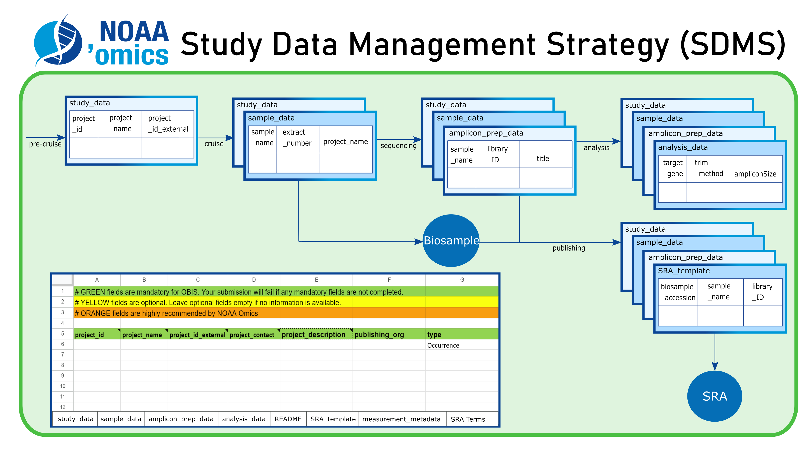

# NOAA Omics Study Data Templates  

These NOAA Omics study data templates were developed based on feedback from NOAA partners at AOML, PMEL, and the NOAA Omics Data and Bioinformatics Supergroup. This template incorporates data standards from [MIxS](https://github.com/aomlomics/omics-data-management/wiki/3-Study-Data-Templates#sample-metadata-templates), [Darwin Core](https://dwc.tdwg.org/terms/), and custom recommended NOAA fields to facilitate data management of a range of omics sample types, from project initiation through data submission. Currently, we provide templates for eDNA survey studies ([MIMARKS Survey](https://www.ncbi.nlm.nih.gov/biosample/docs/packages/)) in three environments: water, sediment, and host-associated. Additional templates are in development to cover other data types and environments. If you are interested in developing a NOAA Omics template for your data/environment type, please reach out to katherine.silliman@noaa.gov!

## General Guidelines  

### Quick tips  

Some quick tips and reminders for using these templates. For more in-depth guidance, see below. 

- Ensure that sample names are consistent between sample_data, prep_data, and asv_data.
- Ensure that the amplicon name provided in amplicon_sequenced in sample_data, prep_data, and analysis_data are all consistent.
- Do not reorganize or rename columns in the 1st section of prep_data (before column N)
- Keep the date_sheet_modified and modified_by as the last 2 columns in each sheet. These are set by the custom onEdit function through Apps Scripts. 
- Do not rename headers. If you wish to provide a custom column, you can add that with a cyan color header.
- Do NOT make edits to the SRA Terms sheet, it is used for the data validation in prep_data
- Saving this file as an Excel file may lose some data validation functionality.
- For blank cells, NCBI only allows 'not collected', 'not applicable' or 'missing'.

### Starting a new study data file

Each template is built with Google Sheets, where every sheet represents a different stage in the project. To start a new project file, go to `File -> Make a copy` and then copy the file into your own Google Drive, naming it with an identifier for your project. WARNING: We have not tested the functionality of the data validation in these sheets when downloaded and opened in Excel, so do so at your own risk.  

### Format

The header of each sheet gives information on the color-coding of the terms, the version number of the sheet, and a row with example values. All of these rows start with a #, which is required for the files to work correctly when submitted to NCBI or reformatted for OBIS. You can delete these or add more header rows if desired, as long as they start with a #.

Next are the terms, or column headers, themselves. If you click on these, you see a Note with the term definition. In-depth definitions and examples can also be found in these docs. 

### Changing column headers

If you change any of the term names, they may not be recognized by NCBI or converted correctly for submission to DarwinCore if you are using the edna2obis pipeline. You can add additional columns if you have custom terms not recorded here, in which case we recommend coloring them CYAN for custom terms you wish to share or RED for internal metadata terms. You can remove any of the Optional or Recommended header names, or you can fill them in as 'not collected', 'not applicable', or 'missing'.  

You can reorganize any of the columns EXCEPT:  
- Columns A-M of the prep_data sheets, as those are in a specific order for submission of raw sequences to NCBI.  
- The last 2 columns `date_modified` and `modified_by`, as these are auto-filled by a Google AppScript which expects them to be in the last 2 columns. 

###  Consistent fields  

There are some shared fields between the sheets, which enable processing by the `edna2obis` pipeline as well as other template processing scripts provided [here](https://github.com/NOAA-Omics/noaa-omics-templates/tree/main/scripts). You must ensure that your entries in these fields are consistent between sheets.  

| Shared term | Sheets | External files|
|---|---|---|
| sample_name | sample_data, prep_data | ASV table (eg, from Tourmaline)|
| amplicon_sequenced | sample_data, prep_data, analysis_data | None |
| project_id | study_data, sample_data | None |
| biosample_accession | sample_data, prep_data | None|

## Environmental sample templates 

| Environment | Term definitions | Blank Template link  | Example Template |
|---|---|---|---|
| Water | [Water template terms](https://noaa-omics-templates.readthedocs.io/en/latest/water-edna-template.html) | [NOAA_MIMARKS.survey.water.6.0](https://docs.google.com/spreadsheets/d/1YBXFU9PuMqm7IT1tp0LTxQ1v2j0tlCWFnhSpy-EBwPw/edit?usp=sharing) | [gomecc4_example](https://docs.google.com/spreadsheets/d/1b7m5u7Cqj-L6vJYk81CHHDNNXftr3JRNCpGgcVJtCEE/edit?usp=drive_link) |
| Host-associated | Host-associated template terms](https://noaa-omics-templates.readthedocs.io/en/latest/host-edna-template.html)  | [NOAA_MIMARKS.survey.host-associated.6.0](https://docs.google.com/spreadsheets/d/1JtWgX_t5PbG0CpEJWHu906yH8Udek3l4I-KOM80MR6M/edit?usp=sharing) |  |
|  |  |  |  |

## Tissue sample templates (coming soon!)  

!!! note

    This project is under active development.

